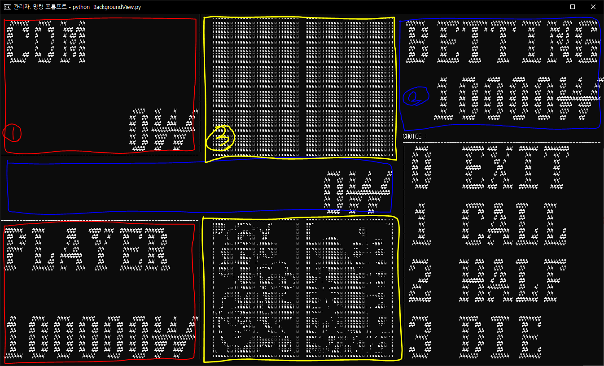

# View 사용법

## 기본 구조

# 0. Requirements
console module 설치 필요

    pip install console

# 1. PlayerView
* PlayerView().display_player(player: int, stakes: int = 0) -> None

> options
> - player : 0(player) / 1(computer)
> - stakes : 잔고(default = 0)

# 2. BettingView
* BettingView().display_betting(money: int) -> None

>options
> - money : call, half 중 하나를 선택했을 때의 배팅금(화면 오른쪽 위)

* BettingView().display_total_betting(money: int) -> None

>options
> - money : 이번 라운드의 전체 배팅금(화면 중앙)

# 3. HandView
* HandView().display_hand(player: int, hand: dict = (0, 0), front: bool = True) -> None:

> options
>  - player : 0(player) / 1(computer)
>  - hand : 패 조합(default = (0,0) : 뒷면 두장)
>  - front : True(앞면, default) / False(뒷면)

# 4. BackgroundView
* BackgroundView() -> None:

> 화면의 기본 틀을 그리는 클래스

* BackgroundView().display_input(pos: tuple) -> int: // 필요시 사용

> options
> - pos : 콘솔입력 커서의 위치를 조정(default = 메뉴박스 위)
> - 0,1,2,3중 하나를 입력받아 값을 반환